# Stack Bootcamp de Data Science

Bootcamp de Data Science realizado pela Stack de 18 a 22 de outubro
- O projeto do bootcamp foi sobre o `Human Resource Analytics`

### HR Analytics

Entendimento do problema

- Quais fatores influencim para um colaborador deixar a empresa?
    - Pessoas satisfeitas?
    - Ambiente de trabalho?
        - CargomDepartamento ...
    - Salário?
    - Tempo na empresa?

- Podemos nos antecipar e saber se um determinado colaborador vai sair da empresa?
    - Desempenho do colaborador.
    - Carga de trabalho
- Como reter pessoas?
- Como diminuir o turnover?

### Tecnologias usadas

##### Docker
- Foi usado para configura o ambiente, usando o `Mysql`, `Minio` e `Airflow`
##### MySql
- O mysql foi usado apr armazena os dados extraidos de outras fontes
##### Minio
- Foi usado como bucket, para todos os dados resultantes do processo de `ETL`
##### Python
- Nesse projeto foi usando a liguagem Python
##### Airflow
- Foi usado como orquestrador, para orquestra o processo de ETL, nesse foi definidos as dags(script) que fizeram todo os processamentos nos dados
##### Scikit-learn 
- Foi usado para criar os modelos de machine learning

##### PyCaret
- Foi usado para encontra o melhor modelos de machine learning

##### Streamlit
- Foi usado para mostra o resultado final do modelo de classificação, criação do Data App

### Estrutura do projeto

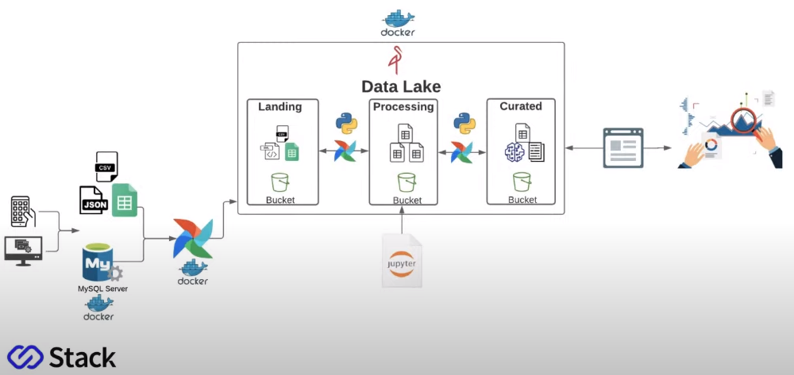


## Preparação do ambiente

1. Faça download do Anaconda no site: [https://www.anaconda.com/products/individual#Downloads](https://www.anaconda.com/products/individual#Downloads)

 2. Instalar o Docker Desktop no Windows ou no Linux

[https://www.docker.com/get-started](https://www.docker.com/get-started)

1. Faça download do Visual Studio code

      [https://code.visualstudio.com/download](https://code.visualstudio.com/download)

### Crie um diretório na sua máquina para armazenar scripts e outros artefatos, exemplo:

*C:\bootcampds*

*/home/<seunome>/bootcampds*

### **Instalação e Configuração do Mysql Server**

Se estiver usando Windows abra o **Powershell** e digite:

Crie o container do mysql habilitando a porta 3307:

`docker run --name mysqlbd1 -e MYSQL_ROOT_PASSWORD=bootcamp -p "3307:3306" -d mysql`

Teste o acesso ao banco de dados usando o Visual Studio Code:

Abra o Visual Studio Code e instale a extensão: **Database Client**

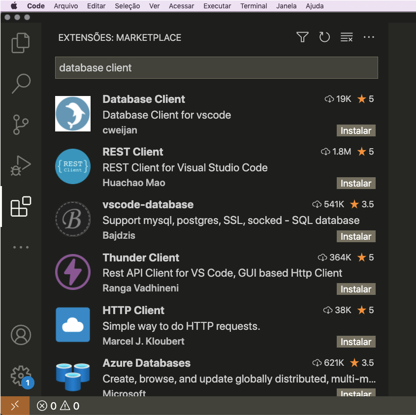

Teste o acesso ao banco de dados Mysql:

Coloque as configurações:

**Host**: 127.0.0.1

**Username**: root

**Port**: 3307

**Password**: bootcamp

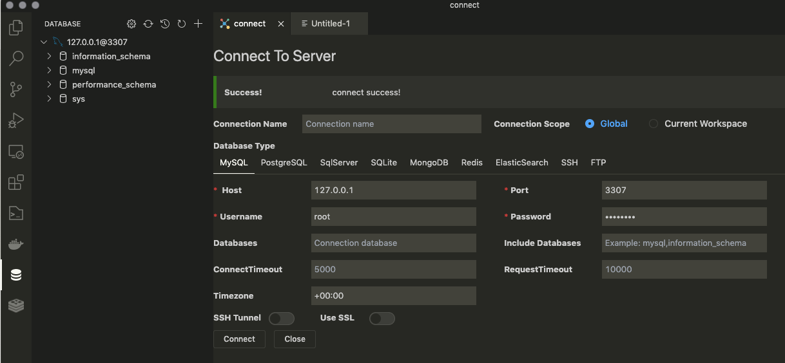

### **Instalação e Configuração do Data Lake com Minio Server**

Dentro do diretório bootcampds crie o diretório **datalake**.

Se estiver usando Windows abra o terminal do Powershell e execute o comando:

`docker run -d -p 9000:9000 -p 9001:9001 -v "$PWD/datalake:/data" minio/minio server /data --console-address ":9001"`

Teste o acesso ao Minio:

Abra o browser e digite: [http://localhost:9001/login](http://localhost:9001/login)

**username**: minioadmin

**password**: minioadmin

### Instalação e Configuração do Airflow.

1. Dentro do **diretório bootcampds** crie o diretório **airflow**.
2. Navegue até o diretório airflow e crie o diretório **dags**.
3. Faça download da imagem e execute o container do Apache Airflow
    
    3a. Se estiver usando Windows abra o terminal do Powershell e execute o comando:
    
    `docker run -d -p 8080:8080 -v "$PWD/airflow/dags:/opt/airflow/dags/" --entrypoint=/bin/bash --name airflow apache/airflow:2.1.1-python3.8 -c '(airflow db init && airflow users create --username admin --password bootcamp --firstname Felipe --lastname Lastname --role Admin --email admin@example.org); airflow webserver & airflow scheduler'`
    
    3b. Instale as bibliotecas necessárias para o ambiente:
    
    Execute o comando abaixo para se conectar ao container do airflow:
    
    `docker container exec -it airflow bash`
    
    Em seguida instale as bibliotecas:
    
    `pip install pymysql` `xlrd` `openpyxl minio`
    
    3c. Se não der nenhum erro, acesse a interface web do Apache Airflow com o endereço (*Aguarde uns 5 minutos antes de abrir o terminal*):
    
    `https://localhost:8080`
    

      **Faça o login de acesso ao Apache Airflow**

Login: admin

Senha: bootcamp

Clique em Admin >> Variables

Crie as seguintes variáveis:

*data_lake_server = 172.17.0.4:9000*
*data_lake_login = minioadmin*
*data_lake_password = minioadmin*

*database_server = 172.17.0.3 ( Use o comando inspect para descobrir o ip do container: docker container inspect mysqlbd1 - localizar o atributo IPAddress)*
*database_login = root*
*database_password = bootcamp*
*database_name = employees*

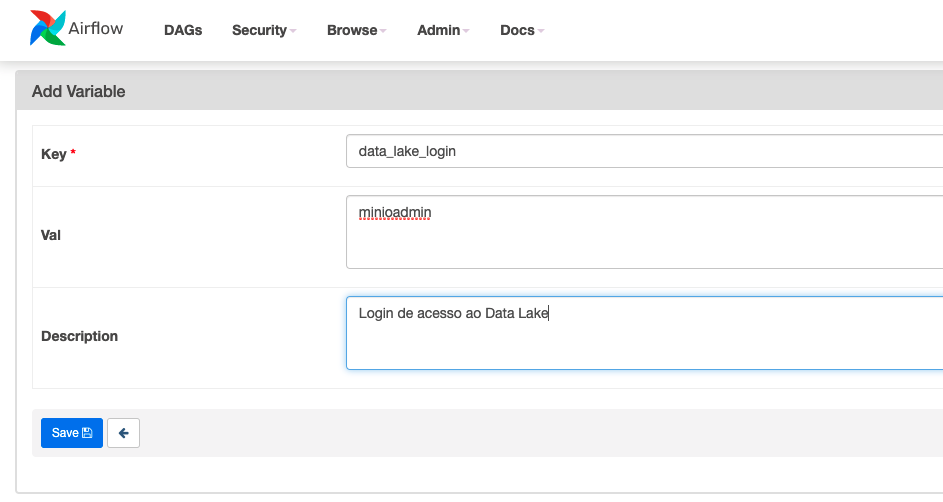

As variáveis criadas devem ficar como:

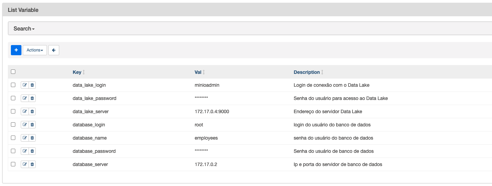

### Configurando o Data Lake


1. Inicie o container do Minio com o comando:
    1. Abra o **Docker Desktop** para iniciar o docker engine
    2. Abra o Powershell (Windows) e execute o comando abaixo para iniciar o container do Minio: `docker container start <nome-do-container>`
    3. Em seguida acesse o console do minio no endereço: [http://localhost:9001/login](http://localhost:9001/login)
    4. Crie os buckets *landing, processing e curated* como na imagem a seguir:
    5. Clique em **Buckets** em seguida clique em **create bucket**
        
        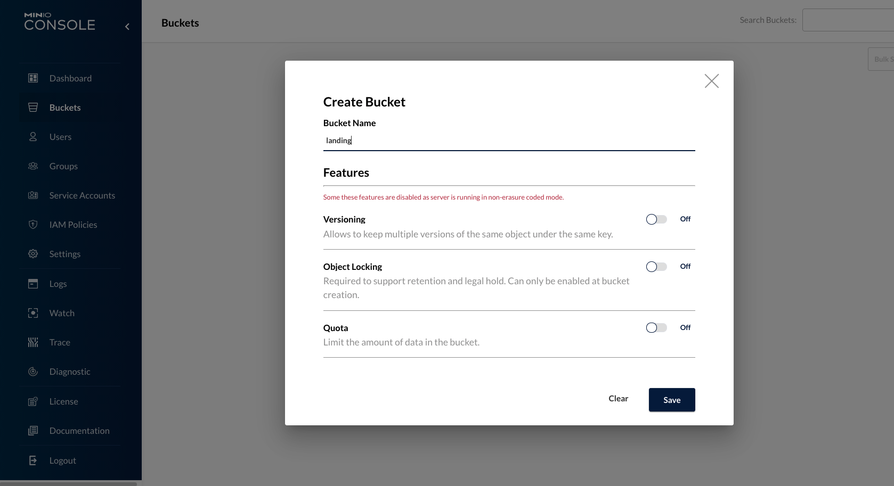
        
    6. Após criar os buckets clique no bucket landing e crie a pasta: **performance-evaluation** em seguida clique em Upload e carregue o arquivo: **employee_performance_evaluation.json** Veja a imagem abaixo:
        
        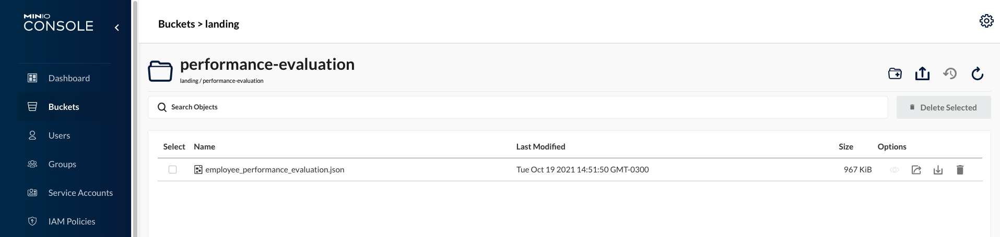
        
    7. Clique no bucket landing
    8. Crie outra pasta chamada **working-hours** e faça upload dos arquivos .xlsx veja como fica na imagem abaixo:
        
        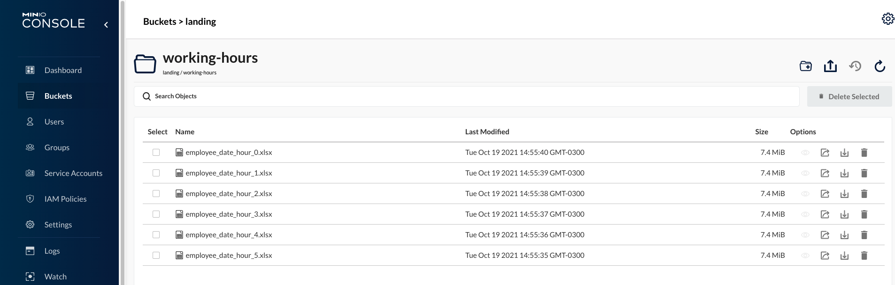
        
    9. Ao clicar no bucket landing ficamos como:
    
    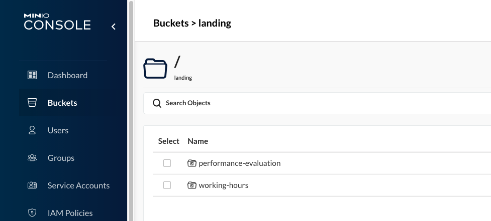
    

## Subindo o banco de dados e carregando o banco de dados

1. Abra o Docker Desktop para iniciar o docker engine
2. Abra o console do Powershell (Windows) ou o terminal linux e execute o comando abaixo para iniciar o container do mysql: `docker container start mysqlbd1`
3. Em seguida abra o Visual Studio Code para carregar o arquivo .sql para dar carga no banco de dados:
4. Clique com o botão direito do mouse na conexão como mostrado na imagem abaixo
    
    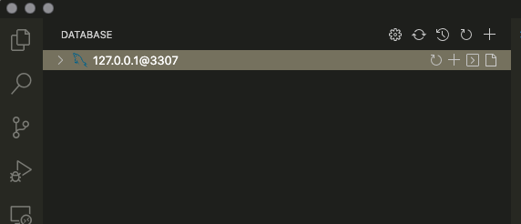
    
5. Escolha a opção Import Sql
6. Aguarde o processo de importação. Após importar clique em atualizar a conexão para visualizar o banco de dados **employees** recém criado. Veja imagem abaixo:
    
    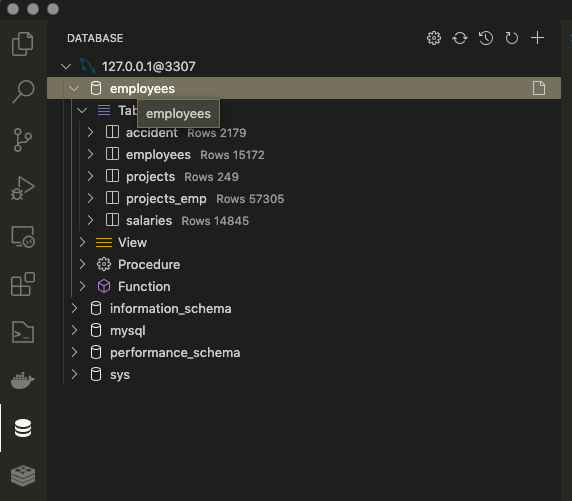
    

Abrindo o Jupyter Notebook

1. Abra o Anaconda Navigator. Se estiver no Windows pesquise no menu iniciar "Anaconda Navigator"
2. Clique em **launch** para abrir o jupyter notebook
    
    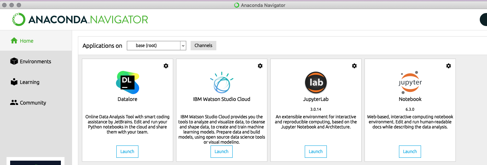
    
3. Ao abrir navegue até o diretorio criado para o bootcamp, por exemplo: **bootcampds**
    
    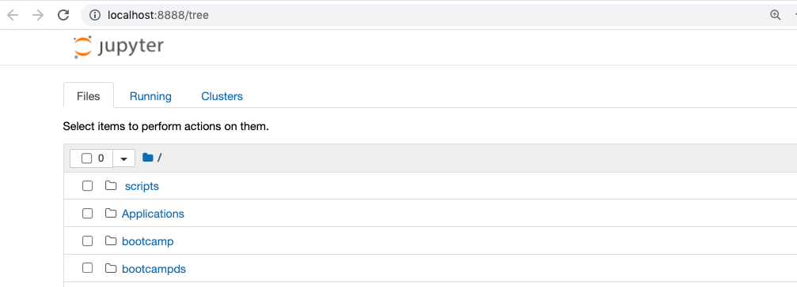
    
4. Deverá conter a estrutura de diretórios como a seguir:
    
    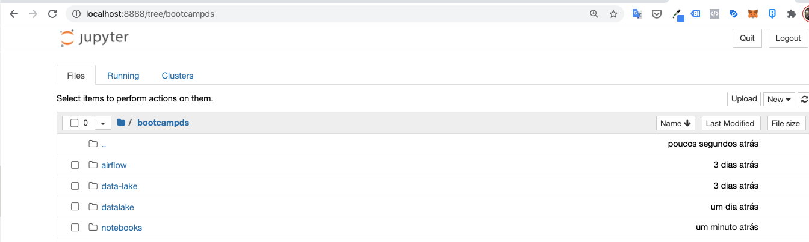
    
5. Clique no diretório notebooks, deverá conter o notebook **modelagem_dados.ipynb**
    
    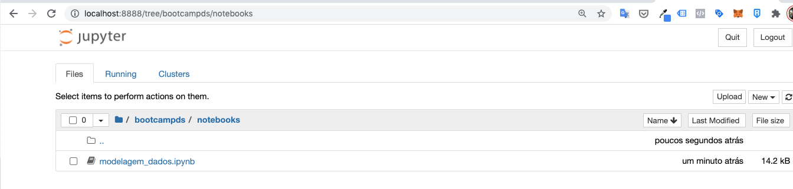
    

## Subindo o Airflow e criando as Dags:

 1. Descompacte os arquivos .py dentro do seu diretório usado no bootcamp, exemplo *C:\Felipe\bootcampds ou /home/felipe/bootcamps*

1. Mova os arquivos .py para o diretório **airflow/dags** como na imagem abaixo:
    
    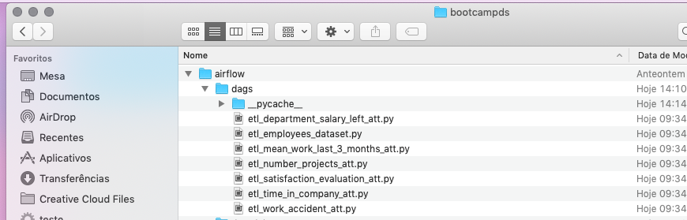
    
2. Atenção: Certifique que todos os arquivos estão dentro do diretório **airflow/dags**
3. Abra o console do Powershell (Windows) ou o terminal linux e execute o comando abaixo para iniciar o container do mysql: `docker container start airflow`
4. Aguarde uns 5 minutos e acesse o console do airflow no endereço: [http://localhost:8080/](http://localhost:8080/)
5. Faça o login com usuário admin e a senha bootcamp.
6. Ao clicar em Dags deve aparecer as dags criadas como na imagem abaixo:
    
    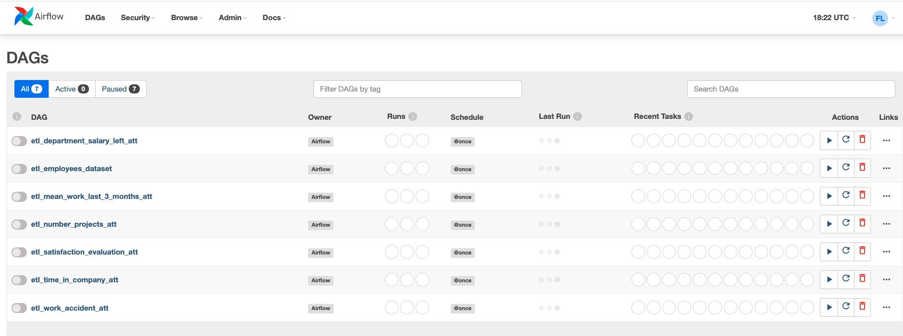
    

## Rodando as Dags:

1. **Atenção**: Antes de executar as dags verifique se o ip do mysql ou do minio alterou.
2. Para verificar use o comando: `docker container inspect mysqlbd1` e visualize o campo IP Address


As dags são scripts python que vão fazer o processamento dos dados, no final desse processo cada dags vai gera o arquivo
com os dados processados.
Com esses dados vamos fazer uma Análise Exploratória de Dados e depois vamos construir de um modelo de classifição usando machine learning
Esse modelo vai ter como entradas as features `satisfaction`, `evaluation`, `averageMonthlyHours`, `yearsAtCompany`  e classe `turnover` que é a 
variavel de predição,  que indica se o funcionario vai deixa a empresa

- Fazendo a [Modelagem de dados](notebooks/modelagem_dados.ipynb)
    - A modelagem foi feita antes das dags, as dags são baseadas nela
- Fazendo [Análise Exploratória de Dados](notebooks/analise.ipynb)
- Criando modelo: [Machine learning](notebooks/machine_learning_deploy.ipynb)
## Executando projeto

```bash
    streamlit run app.py
```
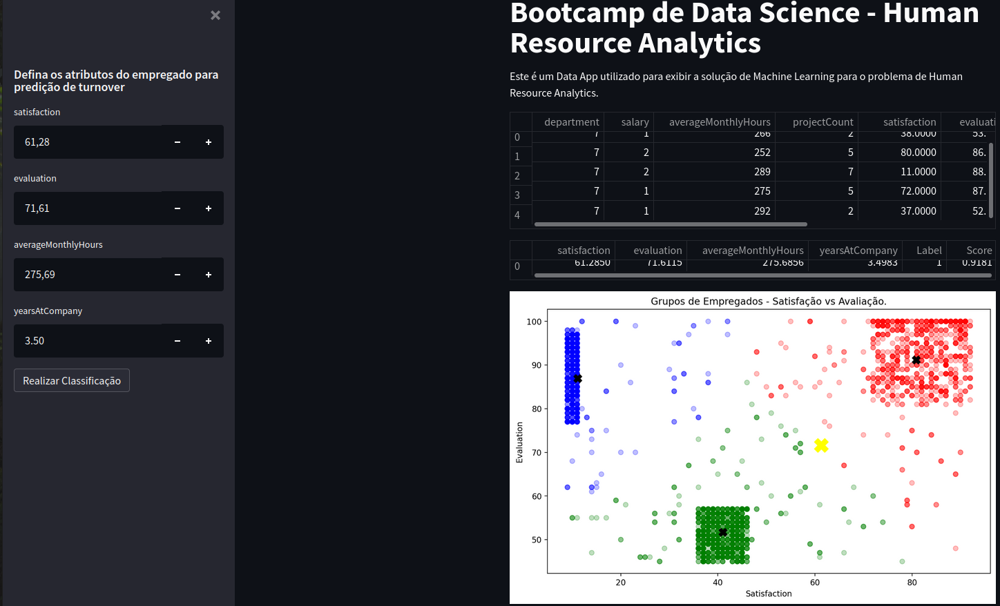